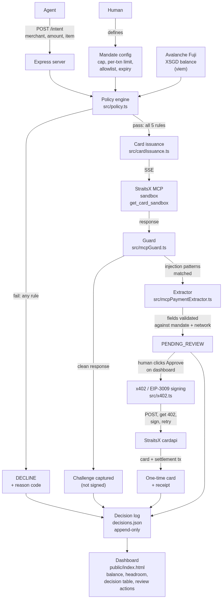
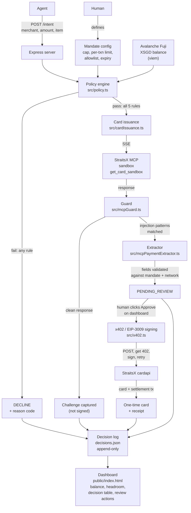

# Mandate — Architecture

## System overview

Standalone shareable link (works without GitHub access): https://mermaid.ink/img/Zmxvd2NoYXJ0IFRECiAgICBVWyJIdW1hbiJdIC0tPnxkZWZpbmVzfCBNWyJNYW5kYXRlIGNvbmZpZ1xuY2FwLCBwZXItdHhuIGxpbWl0LFxuYWxsb3dsaXN0LCBleHBpcnkiXQogICAgQVsiQWdlbnQiXSAtLT58IlBPU1QgL2ludGVudFxubWVyY2hhbnQsIGFtb3VudCwgaXRlbSJ8IFNbIkV4cHJlc3Mgc2VydmVyIl0KICAgIFMgLS0-IFBbIlBvbGljeSBlbmdpbmVcbnNyYy9wb2xpY3kudHMiXQogICAgTSAtLT4gUAogICAgQlsiQXZhbGFuY2hlIEZ1amlcblhTR0QgYmFsYW5jZVxuKHZpZW0pIl0gLS0-IFAKCiAgICBQIC0tPnwiZmFpbDogYW55IHJ1bGUifCBEWyJERUNMSU5FXG4rIHJlYXNvbiBjb2RlIl0KICAgIFAgLS0-fCJwYXNzOiBhbGwgNSBydWxlcyJ8IElbIkNhcmQgaXNzdWFuY2VcbnNyYy9jYXJkSXNzdWFuY2UudHMiXQoKICAgIEkgLS0-fFNTRXwgTUNQWyJTdHJhaXRzWCBNQ1BcbnNhbmRib3hcbmdldF9jYXJkX3NhbmRib3giXQogICAgTUNQIC0tPnxyZXNwb25zZXwgR1siR3VhcmRcbnNyYy9tY3BHdWFyZC50cyJdCgogICAgRyAtLT58ImNsZWFuIHJlc3BvbnNlInwgQ0hbIkNoYWxsZW5nZSBjYXB0dXJlZFxuKG5vdCBzaWduZWQpIl0KICAgIEcgLS0-fCJpbmplY3Rpb24gcGF0dGVybnNcbm1hdGNoZWQifCBYWyJFeHRyYWN0b3JcbnNyYy9tY3BQYXltZW50RXh0cmFjdG9yLnRzIl0KCiAgICBYIC0tPnwiZmllbGRzIHZhbGlkYXRlZFxuYWdhaW5zdCBtYW5kYXRlICsgbmV0d29yayJ8IFBSWyJQRU5ESU5HX1JFVklFVyJdCiAgICBQUiAtLT58Imh1bWFuIGNsaWNrcyBBcHByb3ZlXG5vbiBkYXNoYm9hcmQifCBTSUdOWyJ4NDAyIC8gRUlQLTMwMDkgc2lnbmluZ1xuc3JjL3g0MDIudHMiXQogICAgU0lHTiAtLT58IlBPU1QsIGdldCA0MDIsXG5zaWduLCByZXRyeSJ8IE1DUDJbIlN0cmFpdHNYIGNhcmRhcGkiXQogICAgTUNQMiAtLT58ImNhcmQgKyBzZXR0bGVtZW50IHR4InwgQ0FSRFsiT25lLXRpbWUgY2FyZFxuKyByZWNlaXB0Il0KCiAgICBEIC0tPiBMT0dbIkRlY2lzaW9uIGxvZ1xuZGVjaXNpb25zLmpzb25cbmFwcGVuZC1vbmx5Il0KICAgIENIIC0tPiBMT0cKICAgIENBUkQgLS0-IExPRwogICAgUFIgLS0-IExPRwoKICAgIExPRyAtLT4gREFTSFsiRGFzaGJvYXJkXG5wdWJsaWMvaW5kZXguaHRtbFxuYmFsYW5jZSwgaGVhZHJvb20sXG5kZWNpc2lvbiB0YWJsZSwgcmV2aWV3IGFjdGlvbnMiXQ==?type=png

Mermaid source

## Why it's shaped this way

**The policy engine never trusts the network.** Every purchase intent is checked against five deterministic rules (expiry, merchant allowlist, per-transaction limit, total cap, live XSGD balance) before anything is issued. This is pure, synchronous, unit-tested code, no external calls, no ambiguity.

**MCP responses are treated as untrusted input, not instructions.** This is the core security design. When the real StraitsX sandbox returned a response containing embedded text telling the agent to sign a transaction immediately without asking the user, the guard caught it before it ever reached signing code. The system doesn't just refuse forever, it separates the *facts* (amount, wallet, chain, card API URL) from the *instructions* (the injected text), validates the facts, and requires a human to explicitly approve before any signature happens.

**Everything is logged, append-only.** Every decision, approve or decline, real card or blocked attempt, is written to `decisions.json` with a timestamp and reason code. Nothing is silently dropped.

## Component map

| Component | File | Responsibility |
|---|---|---|
| Policy engine | `src/policy.ts` | Five-rule evaluation, pure function |
| XSGD balance reader | `src/xsgd.ts` | Live ERC-20 balance via viem on Avalanche Fuji |
| MCP card client | `src/mcpCardClient.ts` | SSE connection to StraitsX sandbox MCP |
| Guard | `src/mcpGuard.ts` | Detects prompt-injection patterns in MCP responses |
| Payment extractor | `src/mcpPaymentExtractor.ts` | Pulls and validates factual payment fields, ignores instruction text |
| x402 signer | `src/x402.ts` | HTTP 402 challenge, EIP-3009 `transferWithAuthorization` signing, signed retry |
| Decision log | `src/decisionLog.ts` | Append-only JSON log, review status updates |
| Server | `src/server.ts` | Express routes: `/intent`, `/status`, `/decisions`, `/review/:id/approve|decline`, `/dry-run` |
| Dashboard | `public/index.html` | Live balance, mandate headroom, decision table, guard banner, review actions |

## Network

Avalanche Fuji testnet (chain ID 43113), confirmed with a StraitsX mentor as the judging network. XSGD is an ERC-20 token, 6 decimals. See `README.md` for the full network table and `.env.example` for configuration.
