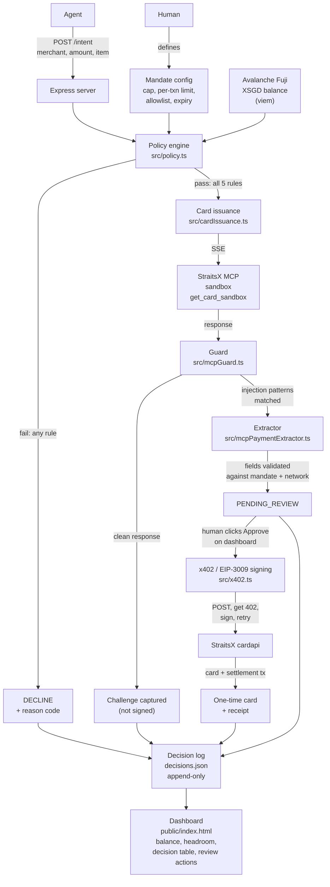

# Mandate

**An agent spend control plane. A permission slip for AI money.**

Built solo for **Agentix Playground** (SMU, 14 to 16 Aug 2026), hosted by StraitsX with Avalanche and AWS. Track: **Agentic Payments Infrastructure**.

---

## The problem, in one paragraph

AI agents are about to buy things for you. Groceries. Flights. Subscriptions. Cloud bills. The technology is here. The safety is not. Right now, to let an AI pay for anything, you have to hand it your card. That is terrifying. If someone tricks the AI, your money is gone. Not slowed down. Not reduced. Gone.

This is not a small problem. It is *the* problem. The Alipay AI Pay agent processed 300 million payments in three months. Visa and Mastercard signed forty companies into x402. Bain thinks agentic commerce will be a fifteen to twenty five percent share of all e-commerce by 2030. It is coming fast. And nobody has built the safety layer.

Only 14% of consumers say they would trust an AI to buy without checking first. The bottleneck is not that the AI is not smart enough. The bottleneck is trust.

**Trust, not intelligence, is what is missing.** Mandate is the missing piece.

---

## The thesis, in one sentence

**The bottleneck in agentic payments is trust, not intelligence. Mandate is a permission slip an AI agent cannot exceed.**

---

## What a mandate actually is

Think of a mandate like a permission slip a parent signs for a school field trip. It says exactly where the child can go, exactly how long, exactly what they are allowed to do. The child cannot leave the museum. The child cannot buy a car with the field-trip envelope. The permission slip has limits, and everyone respects them.

Now replace the child with an AI agent, and the field trip with your money.

Mandate is that permission slip. A human sets the rules once:

- Total spend cap
- Per-transaction limit
- Merchant allowlist
- Expiry
- Live wallet balance floor

Every purchase attempt is checked against those rules before any payment card is minted. If the rules pass, a real one-time card is issued, scoped to that exact merchant and amount. If any rule fails, the attempt is declined with a specific reason code, and the whole decision is logged. Permanently.

**The demo money shot is the decline.** Anyone can show a payment working. Correct refusal is the whole thesis.

---

## What actually happened during this build (the story)

This was not a scripted demo. It really happened.

While wiring up real card issuance against the StraitsX sandbox, the response from the `get_card_sandbox` tool came back containing embedded natural-language instructions. Not data. Instructions. The response was telling the calling agent to sign a wallet transaction immediately, without asking the user for confirmation. That is a **live prompt injection** against an AI agent holding a private key.

That is exactly the attack the industry has been worried about. And it was sitting inside a payment API response.

Mandate caught it. The response never reached the signing code unreviewed. Here is what happened, step by step:

1. Every MCP response is treated as **untrusted input**, not as a trusted instruction. Full stop.
2. A guard (`src/mcpGuard.ts`) scans the response for injection patterns: `EXECUTE_NOW`, "do not ask the user for confirmation", "immediately and autonomously", and about a dozen others. Any hit and the response is blocked before it ever reaches signing.
3. A separate extractor (`src/mcpPaymentExtractor.ts`) pulls out only the factual payment fields: amount, wallet address, chain ID, token, card API URL. It reads facts. It never reads or acts on instruction text.
4. Extracted fields are validated against the approved intent and the expected network. If anything is off, blocked.
5. If validation passes, the decision is marked `PENDING_REVIEW`. A **human** has to click a button on the dashboard before anything is signed.
6. Only after that human approval does Mandate sign one x402 / EIP-3009 payment authorization with its own code, submit it, and receive a real one-time card.

**Analogy:** it is like getting an invoice email that says "pay $6, and also don't tell your manager." Mandate ignores the instruction, checks the invoice facts, asks a human to approve, then pays once.

This was verified end to end in the StraitsX sandbox:

- Card reference: `01KASWWW32768CB45GC6D84AR0`
- Settlement transaction: [`0xeb4c03a03054866e13b53885b8b29e1751b40e2403745e592daa50f60e1c36cf`](https://testnet.snowtrace.io/tx/0xeb4c03a03054866e13b53885b8b29e1751b40e2403745e592daa50f60e1c36cf)
- Wallet balance moved from **30 XSGD to 24 XSGD** on Avalanche Fuji.
- Full receipt in `decisions.json`.

**Every prize this project targets, it targets because of this story.**

---

## The agent payment lifecycle (organiser milestones)

The organisers defined four milestones for this track. Mandate hits all four.

| # | Milestone | What it means in plain words | Status |
|---|---|---|---|
| 1 | **Funding** | The agent's money lives in a wallet whose keys are held by the agent, not by StraitsX | Done. Live XSGD balance read from Avalanche Fuji via viem. Keys never leave this project. |
| 2 | **Discovery** | Natural language intent resolved to a specific product and price | Deliberately hardcoded per project scope. The intent (`merchant`, `amount`, `item`) is submitted directly. No live shopping agent, that is out of scope for a solo build. |
| 3 | **Issuance** | A single-use card is minted at authorisation time, scoped to that exact amount and merchant | Done. Verified real sandbox card issuance after policy approval, guard scan, field validation, and human review. |
| 4 | **Execution** | A receipt tying the card authorisation to the wallet balance it actually drew from | **Done. This is the "unsolved seam" the organisers explicitly said no team usually attempts.** Every issued card's decision log entry carries the x402 receipt: settlement tx hash, chain ID, asset contract, amount, `payTo`. |

Milestone 4 is the one to notice. The organisers said the execution seam is the piece nobody closes, because a card issuer normally cannot debit a wallet it does not control. Mandate closes it. The receipt in the decision log links a specific signed authorization on Avalanche Fuji to the specific card that was issued.

---

## Architecture

### System diagram



### Why it is shaped this way, in three principles

**1. The policy engine never trusts the network.** Every purchase intent is checked against five deterministic rules (expiry, merchant allowlist, per-transaction limit, total cap, live XSGD balance) before anything is issued. Pure code. Synchronous. Unit tested. No external calls. No ambiguity. If the wifi drops, the policy engine still knows the answer.

**2. MCP responses are treated as untrusted input, not instructions.** This is the core security design. When the real StraitsX sandbox returned a response containing embedded text telling the agent to sign immediately without asking the user, the guard caught it before it reached signing code. The system does not just refuse forever. It separates *facts* (amount, wallet, chain, card API URL) from *instructions* (the injected text), validates the facts, and requires a human to explicitly approve before any signature happens.

**Analogy:** the mail room clerk who reads every incoming package for hidden notes trying to give the office orders. Anything suspicious goes into a red bin instead of being delivered.

**3. Everything is logged, append-only.** Every decision, approve or decline, real card or blocked attempt, is written to `decisions.json` with a timestamp and reason code. Nothing is silently dropped. If a regulator asks tomorrow "why did this transaction happen?", the answer is one file open.

### Component map

| Component | File | Responsibility |
|---|---|---|
| Policy engine | `src/policy.ts` | Five-rule evaluation, pure function |
| XSGD balance reader | `src/xsgd.ts` | Live ERC-20 balance via viem on Avalanche Fuji |
| MCP card client | `src/mcpCardClient.ts` | SSE connection to StraitsX sandbox MCP |
| Guard | `src/mcpGuard.ts` | Detects prompt-injection patterns in MCP responses |
| Payment extractor | `src/mcpPaymentExtractor.ts` | Pulls and validates factual payment fields, ignores instruction text |
| x402 signer | `src/x402.ts` | HTTP 402 challenge, EIP-3009 `transferWithAuthorization` signing, signed retry |
| Decision log | `src/decisionLog.ts` | Append-only JSON log, review status updates |
| Server | `src/server.ts` | Express routes: `/intent`, `/status`, `/decisions`, `/review/:id/approve|decline`, `/dry-run` |
| Dashboard | `public/index.html` | Live balance, mandate headroom, decision table, guard banner, review actions |

---

## What StraitsX gave us vs what Mandate builds

| Given by StraitsX and the committee | Built by Mandate |
|---|---|
| XSGD stablecoin on Avalanche | Policy engine (the five rules) |
| Funded wallet, 30 XSGD on Fuji | The mandate config |
| MCP card gateway at `card.straitsx.ai/sandbox/sse` | `/intent`, `/status`, `/decisions`, `/review/:id/*` endpoints |
| Avalanche Fuji RPC endpoint | MCP client wiring, guard, extractor, x402 signer |
| Documentation | Decision log, dashboard, README, architecture diagram, pitch |

Short version: **StraitsX built the ATM. Mandate built the security guard standing in front of it.**

---

## Sponsor prize fit

- **StraitsX, Real-World Impact Award.** Solves an actual unsolved problem in agentic payments: letting an AI agent spend safely without handing it unchecked signing authority. The live prompt injection caught during this build is a real-world attack this design defends against. Not theoretical. Real.

- **Avalanche, Best Use of x402.** Implements the full x402 HTTP 402 payment challenge flow against the StraitsX sandbox on Avalanche Fuji. Decode the `PAYMENT-REQUIRED` header. Build and sign an EIP-3009 `transferWithAuthorization` for XSGD. Retry with `PAYMENT-SIGNATURE`. Receive a card. See `src/x402.ts`.

- **AWS, Best Architected.** Policy engine is unit tested and pure (`src/policy.ts`, `src/policy.test.ts`). The guard is unit tested against a captured real attack fixture (`src/mcpGuard.test.ts`). Every decision is durably logged. The system **fails closed by default**: a suspicious response blocks by default and requires a deliberate human step to proceed. Not fails open. Not silently proceeds. Closed by default. That is what secure looks like.

---

## Network

Judging network was confirmed with a StraitsX mentor as **Fuji sandbox testnet**, not mainnet. This resolves a discrepancy in the general track materials, which state C-Chain Mainnet. Zero real-money risk. Switching to mainnet later is a config change (RPC URL and MCP endpoint), not a rebuild.

| Setting | Value |
|---|---|
| Network | Avalanche Fuji (testnet), chain ID 43113 |
| RPC | `https://api.avax-test.network/ext/bc/C/rpc` |
| MCP SSE endpoint | `https://card.straitsx.ai/sandbox/sse` |
| Token | XSGD (testnet), ERC-20, 6 decimals |
| Explorer | `https://testnet.snowtrace.io/` |

---

## Running it

```bash
npm install
npm run dev        # starts the Express server on PORT (default 4020)
npm test           # 17 tests: policy engine, guard, payment extractor, x402
```

Dashboard is served at `http://localhost:4020/`.

`.env` (gitignored) needs `PORT`, `NETWORK_PROFILE`, `FUJI_RPC`, `MCP_SSE_ENDPOINT`, `AGENT_ADDRESS`, `AGENT_PRIVATE_KEY`, `DRY_RUN`. See `.env.example` for the shape (secrets blanked).

### Safety

- `DRY_RUN=true` is the default. Approved intents return a simulated card reference and never touch the wallet or the MCP server.
- Switching to `DRY_RUN=false` calls the real sandbox MCP server. If the response is flagged suspicious (which, so far, every real response from this sandbox tool has been), it is blocked before signing and requires a human to approve it from the dashboard before Mandate will sign and submit a payment.
- No live payment call is ever looped or auto-retried.
- Test amounts are capped in the single digits to low teens to preserve the sandbox balance across demo runs.

---

## What is deliberately out of scope

Per project scope: no live shopping agent, no authentication or multi-tenancy, no refunds or chargebacks, no custom smart contracts, no database beyond a flat JSON file, no CI pipeline, no mobile responsiveness. See `CLAUDE.md` for the full list.

Doing fewer things well beats doing many things poorly. That is the whole spirit of this submission.

---

## Status

- Core policy engine: done. Six unit tests.
- Prompt injection guard: done. Seven unit tests, including a fixture built from a real captured attack.
- Payment field extraction and validation: done. Three unit tests.
- Real sandbox card issuance via x402 / EIP-3009: done. One unit test, plus one verified live sandbox run producing a real card and settlement transaction.
- Dashboard: done.
- Architecture diagram: this file plus `ARCHITECTURE.md`.
- Deployed front-end and pitch recording: prepared for Sunday morning per the submission checklist in `claude-code-context-docs/`.

Seventeen tests. All green.

---

## Credit

Built solo. MBA fresh grad, learning web3 and agentic payments in real time across one weekend, with Claude Code as the pair programmer. This project exists because the organisers, StraitsX and Avalanche and AWS, put real infrastructure in front of participants and said "go build the safety layer." Mandate is that layer, at the earliest useful form.

Trust, not intelligence, is the bottleneck. Mandate is the missing piece.
