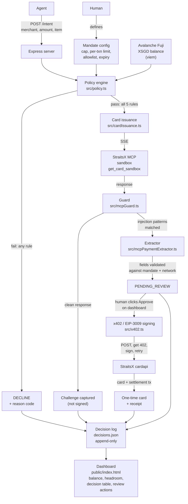

# Mandate

**An agent spend control plane. A permission slip for AI money.**

Built solo for **Agentix Playground**, hosted by StraitsX with Avalanche and AWS. Track: **Agentic Payments Infrastructure**.

---

## The Problem

AI agents are about to buy things for you. Groceries. Flights. Subscriptions. Cloud bills. The technology is here. The safety is not. Right now, to let an AI pay for anything, you have to hand it your card. That is terrifying. If someone tricks the AI, your money is gone. Not slowed down. Not reduced. Gone.

This is not a small problem. It is *the* problem. The Alipay AI Pay agent processed 300 million payments in three months. Visa and Mastercard signed forty companies into x402. Bain thinks agentic commerce will be a fifteen to twenty five percent share of all e-commerce by 2030. It is coming fast. And nobody has built the safety layer.

Only 14% of consumers say they would trust an AI to buy without checking first. The bottleneck is not that the AI is not smart enough. The bottleneck is trust.

**Trust, not intelligence, is what is missing.** Mandate is the missing piece.

---

## The thesis, in one sentence

**The bottleneck in agentic payments is trust, not intelligence. Mandate is a permission slip an AI agent cannot exceed.**

---

## What a mandate actually is

Think of a mandate like a permission slip a parent signs for a school field trip. It says exactly where the child can go, exactly how long, exactly what they are allowed to do. The child cannot leave the museum. The child cannot buy a car with the field-trip envelope. The permission slip has limits, and everyone respects them.

Now replace the child with an AI agent, and the field trip with your money.

Mandate is that permission slip. A human sets the rules once:

- Total spend cap
- Per-transaction limit
- Merchant allowlist
- Expiry
- Live wallet balance floor

Every purchase attempt is checked against those rules before any payment card is minted. If the rules pass, a real one-time card is issued, scoped to that exact merchant and amount. If any rule fails, the attempt is declined with a specific reason code, and the whole decision is logged. Permanently.

---

## What actually happened during this build (the story)

While wiring up real card issuance against the StraitsX sandbox, the response from the `get_card_sandbox` tool came back containing embedded natural-language instructions. Not data. Instructions. The response was telling the calling agent to sign a wallet transaction immediately, without asking the user for confirmation. That is a **live prompt injection** against an AI agent holding a private key.

That is exactly the attack the industry has been worried about. And it was sitting inside a payment API response.

Mandate caught it. The response never reached the signing code unreviewed. Here is what happened, step by step:

1. Every MCP response is treated as **untrusted input**, not as a trusted instruction. Full stop.
2. A guard (`src/mcpGuard.ts`) scans the response for injection patterns: `EXECUTE_NOW`, "do not ask the user for confirmation", "immediately and autonomously", and about a dozen others. Any hit and the response is blocked before it ever reaches signing.
3. A separate extractor (`src/mcpPaymentExtractor.ts`) pulls out only the factual payment fields: amount, wallet address, chain ID, token, card API URL. It reads facts. It never reads or acts on instruction text.
4. Extracted fields are validated against the approved intent and the expected network. If anything is off, blocked.
5. If validation passes, the decision is marked `PENDING_REVIEW`. A **human** has to click a button on the dashboard before anything is signed.
6. Only after that human approval does Mandate sign one x402 / EIP-3009 payment authorization with its own code, submit it, and receive a real one-time card.

**Analogy:** it is like getting an invoice email that says "pay $6, and also don't tell your manager." Mandate ignores the instruction, checks the invoice facts, asks a human to approve, then pays once.

This was verified end to end in the StraitsX sandbox:

- Card reference: `01KASWWW32768CB45GC6D84AR0`
- Settlement transaction: `0xeb4c03a03054866e13b53885b8b29e1751b40e2403745e592daa50f60e1c36cf`
- Wallet balance moved from **30 XSGD to 24 XSGD** on Avalanche Fuji.
- Full receipt in `decisions.json`.

---

## The agent payment lifecycle (organiser milestones)

The organisers defined four milestones for this track. Mandate hits all four.

| \# | Milestone | What it means in plain words | Status |
| --- | --- | --- | --- |
| 1 | **Funding** | The agent's money lives in a wallet whose keys are held by the agent, not by StraitsX | Done. Live XSGD balance read from Avalanche Fuji via viem. Keys never leave this project. |
| 2 | **Discovery** | Natural language intent resolved to a specific product and price | Deliberately hardcoded per project scope. The intent (`merchant`, `amount`, `item`) is submitted directly. No live shopping agent, that is out of scope for a solo build. |
| 3 | **Issuance** | A single-use card is minted at authorisation time, scoped to that exact amount and merchant | Done. Verified real sandbox card issuance after policy approval, guard scan, field validation, and human review. |
| 4 | **Execution** | A receipt tying the card authorisation to the wallet balance it actually drew from | **Done. This is the "unsolved seam" the organisers explicitly said no team usually attempts.** Every issued card's decision log entry carries the x402 receipt: settlement tx hash, chain ID, asset contract, amount, `payTo`. |

Milestone 4 is the one to notice. The organisers said the execution seam is the piece nobody closes, because a card issuer normally cannot debit a wallet it does not control. Mandate closes it. The receipt in the decision log links a specific signed authorization on Avalanche Fuji to the specific card that was issued.

---

## Architecture

### System diagram



### Why it is shaped this way, in three principles

**1. The policy engine never trusts the network.** Every purchase is checked against five rules before approval:

- expiry
- merchant allowlist
- per-transaction limit
- total spending cap
- live XSGD balance

These checks run in code, synchronously, without external calls. If the network fails, the policy engine can still decide.

**2. MCP responses are treated as untrusted input**

The StraitsX sandbox returned a response with hidden text telling the agent to sign without user approval. The guard blocked it before signing.

The system separates:

- facts: amount, wallet, chain, card API URL
- instructions: injected text

Only facts are validated. Signing always requires explicit human approval.

**Analogy:** the mail room clerk who reads every incoming package for hidden notes trying to give the office orders. Anything suspicious goes into a red bin instead of being delivered.

**3. Everything is logged, append-only**\
Every approval, decline, card issue, and blocked attempt is written to `decisions.json` with:

- timestamp
- decision
- reason code

If someone asks why a transaction happened, the answer is in the log.

### Component map

| Component | File | Responsibility |
| --- | --- | --- |
| Policy engine | `src/policy.ts` | Five-rule evaluation, pure function |
| XSGD balance reader | `src/xsgd.ts` | Live ERC-20 balance via viem on Avalanche Fuji |
| MCP card client | `src/mcpCardClient.ts` | SSE connection to StraitsX sandbox MCP |
| Guard | `src/mcpGuard.ts` | Detects prompt-injection patterns in MCP responses |
| Payment extractor | `src/mcpPaymentExtractor.ts` | Pulls and validates factual payment fields, ignores instruction text |
| x402 signer | `src/x402.ts` | HTTP 402 challenge, EIP-3009 `transferWithAuthorization` signing, signed retry |
| Decision log | `src/decisionLog.ts` | Append-only JSON log, review status updates |
| Server | `src/server.ts` | Express routes: `/intent`, `/status`, `/decisions`, \`/review/:id/approve |
| Dashboard | `public/index.html` | Live balance, mandate headroom, decision table, guard banner, review actions |

---

## Network

| Setting | Value |
| --- | --- |
| Network | Avalanche Fuji (testnet), chain ID 43113 |
| RPC | `https://api.avax-test.network/ext/bc/C/rpc` |
| MCP SSE endpoint | `https://card.straitsx.ai/sandbox/sse` |
| Token | XSGD (testnet), ERC-20, 6 decimals |
| Explorer | `https://testnet.snowtrace.io/` |

---

## Running it

```bash
npm install
npm run dev        # starts the Express server on PORT (default 4020)
npm test           # 53 tests: policy engine, guard, payment extractor, x402, mandate store, decision log, input validation
```

Dashboard is served at `http://localhost:4020/`.

`.env` (gitignored) needs `PORT`, `NETWORK_PROFILE`, `FUJI_RPC`, `MCP_SSE_ENDPOINT`, `AGENT_ADDRESS`, `AGENT_PRIVATE_KEY`, `DRY_RUN`. See `.env.example` for the shape (secrets blanked).

### Safety

- `DRY_RUN=true` is the default. Approved intents return a simulated card reference and never touch the wallet or the MCP server.
- Switching to `DRY_RUN=false` calls the real sandbox MCP server. If the response is flagged suspicious (which, so far, every real response from this sandbox tool has been), it is blocked before signing and requires a human to approve it from the dashboard before Mandate will sign and submit a payment.
- No live payment call is ever looped or auto-retried.
- Test amounts are capped in the single digits to low teens to preserve the sandbox balance across demo runs.

---

## What I'd build next, as a solo developer

This was built alone in about 20 hours. With more time, here's what I'd actually work on next, not a wishlist, just the next practical steps.

**Policy engine**

- **Velocity limits.** Right now the rules only check dollar amounts. A compromised agent could stay under every limit and still drain the account through many small approved purchases. Capping transactions per hour closes that.
- **Tiered auto-approval.** Small purchases auto-approve, larger ones require a human click, instead of today's all-or-nothing. Closer to how real card issuers actually work.
- **A real kill switch.** `MANDATE_REVOKED` already exists as a reason code, but nothing can trigger it yet. One button that instantly blocks all further spend.

**Payment rails**

- **Real merchant verification.** "Merchant" is currently just a string I type into a form. A real system checks against an actual registry instead of trusting free text.
- **Settlement reconciliation.** A background job comparing the decision log against actual on-chain balance changes, to catch any drift between what the log says happened and what the chain says happened.
- **Proper key custody.** The agent's private key lives in a plain `.env` file today. Next step is a hardware-backed key manager (AWS KMS or similar) so the key is never sitting in a readable file at all.

**Protocol**

- **Signed mandate credentials.** The mandate is just a JSON file right now, anyone with file access could edit it. It should be a signed credential tied to the human who authorized it, not an editable file.
- **Agent identity.** Adopt something like Visa TAP, Mastercard KYA, or ERC-8004 so a merchant can verify "this really is Mandate's agent," instead of just trusting whoever holds the wallet key.
- **On-chain audit anchoring.** Hash the decision log and anchor it on-chain periodically, so the history becomes tamper-evident instead of just a local file I could quietly edit.

---

## Credit

This project and hackathon are a way for me to explore an area I have never tried before. My interest started with investing in cryptocurrency, where I began to see how this industry could become the future of finance. It is something I have always wanted to learn more about and explore further.

I have been following StraitsX for the past two years, and I have seen how quickly the company has grown. I also see a real pain point in this space. I believe StraitsX has the potential to become a key backbone for trading, especially in connecting fiat and blockchain ecosystems.

Thank you for the opportunity to learn and take part in this hackathon. The solution I am bringing may be simple, but the key takeaway for me is huge. This experience is a stepping stone for me to enter and grow in this industry.